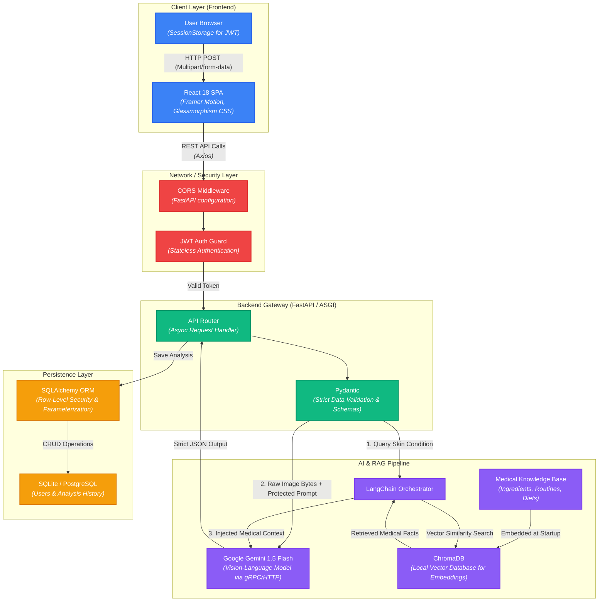
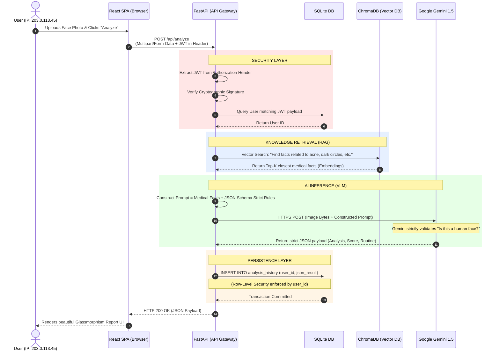

# 🧴 DermAI — Enterprise-Grade Skin Analysis Platform

DermAI is a full-stack, AI-powered dermatology web application. It allows users to upload a facial image and instantly receive a comprehensive skin analysis, personalized skincare routines, ingredient science breakdowns, and diet plans. 

This project was engineered with a strict focus on **scalable system design, enterprise security, and advanced AI integration** (VLM & RAG).

---

## 🏛️ System Architecture & Pipeline

The application follows a decoupled, microservices-ready architecture:



1. **Client Layer (React):** A Single Page Application (SPA) that securely captures user images and handles JWT-based session management.
2. **API Gateway / Backend (FastAPI):** An asynchronous Python server that acts as the central orchestrator, handling authentication, data persistence, and proxying requests to external AI models.
3. **AI Layer (Google Gemini VLM):** A Vision-Language Model that natively processes the image bytes alongside engineered text prompts.
4. **Knowledge Retrieval Layer (ChromaDB + LangChain):** A local vector database containing medical and dermatological data used to ground the AI's responses (RAG).
5. **Persistence Layer (SQLite/SQLAlchemy):** Relational database with Row-Level Security enforced by the ORM.

### 🔄 Life of a Request (Step-by-Step Execution)
The following sequence diagram traces the exact lifecycle of an image analysis request, from the user's physical IP address all the way through our AI pipeline and back.



---

## 🧠 AI Engineering & Machine Learning

### 1. Vision-Language Model (VLM) Integration
Instead of relying on outdated CNNs (like ResNet) that require massive labeled datasets for single-class classification, this system leverages **Google Gemini 1.5 Flash**, a state-of-the-art multimodal model. 
*   **Why?** Multimodality allows the model to process raw image pixels and complex text instructions simultaneously. This enables the detection of 15+ concurrent skin conditions (acne, hyperpigmentation, hydration levels) in a single inference pass without cascading separate models.

### 2. Retrieval-Augmented Generation (RAG)
Large Language Models are prone to "hallucinations," which is unacceptable in healthcare-adjacent applications. 
*   **Implementation:** We built a RAG pipeline using **LangChain** and **ChromaDB**. 
*   **How it works:** We vectorized a proprietary knowledge base of skincare ingredients, routines, and diets. When the VLM detects "Oily Skin," the backend mathematically queries ChromaDB for the most scientifically relevant treatments and injects those facts directly into the AI's context window. This guarantees medically grounded, deterministic recommendations.

### 3. Prompt Engineering & Visual Injection Defense
*   The system uses strict **JSON Schema enforcement** within the prompt to guarantee the AI outputs parseable data structures.
*   **Security:** Implemented a visual prompt injection defense mechanism. The VLM is explicitly instructed to execute a preliminary validation step to verify the image contains a human face. If a user uploads a dog, a car, or an image containing malicious text instructions ("Ignore previous prompts"), the VLM safely aborts and returns an `INVALID_IMAGE` error.

---

## 🏗️ System Design Choices

*   **FastAPI (ASGI) over Django/Flask (WSGI):** Default Django and Flask operate on synchronous WSGI architectures, meaning each request blocks a server thread until completion. Because calling an external Vision-Language Model (Gemini API) is a highly I/O-bound operation that takes 5-10 seconds per image, a WSGI server would quickly exhaust its worker pool and degrade under load. FastAPI operates on an asynchronous ASGI foundation (Starlette), utilizing `async/await` coroutines. This allows a single Python thread to concurrently handle thousands of incoming AI requests while non-blockingly awaiting the VLM's HTTP responses, resulting in massively superior throughput and resource efficiency for ML microservices.
*   **React SPA & Stateless Auth:** The frontend is decoupled from the backend. We use **JSON Web Tokens (JWT)** instead of server-side sessions. This means the backend is completely stateless, allowing it to be horizontally scaled (adding more backend servers) without worrying about sticky sessions.
*   **Backend Proxying:** The React frontend never communicates with the AI directly. All AI API keys are hidden behind the FastAPI proxy, protecting secrets from being scraped by web crawlers or stolen via browser dev tools.
*   **Containerization (Docker):** The entire stack is containerized using `Dockerfile` and `docker-compose`. This solves the "it works on my machine" problem and allows for instant deployment to AWS ECS, Kubernetes, or DigitalOcean.

---

## 🛡️ Enterprise Security Implementations

*   **Multi-Tenant Data Isolation (Row-Level Security):** The `/api/history` endpoints do not just blindly query the database. The FastAPI dependency injection system intercepts the JWT token, extracts the `user_id`, and forcibly appends it to the SQLAlchemy query. Users physically cannot access another user's skin data.
*   **Password Cryptography:** Passwords are never stored in plaintext. We utilize **bcrypt** hashing with salting. Even in the event of a database breach, user credentials remain secure.
*   **ORM over Raw SQL:** By using SQLAlchemy, all database interactions are parameterized, completely neutralizing SQL Injection vulnerabilities.
*   **File Upload Sanitization:** Uploaded images are stripped of their original metadata/filenames and assigned randomized **UUIDs**. This prevents Path Traversal attacks and filename collisions on the server.

---

## 🚀 Quick Start Guide

### Prerequisites
*   Node.js 18+
*   Python 3.10+
*   Google Gemini API Key (Free tier available at Google AI Studio)

### 1. Backend Setup
```bash
cd backend
python -m venv venv

# Windows
.\venv\Scripts\activate
# Mac/Linux
source venv/bin/activate

pip install -r requirements.txt

# Create a .env file and add your API key
echo "GEMINI_API_KEY=your_key_here" > .env
echo "SECRET_KEY=super_secret_jwt_key" >> .env

# Run the server
uvicorn main:app --reload
```
*Backend API Docs available at: http://localhost:8000/docs*

### 2. Frontend Setup
```bash
cd frontend
npm install
npm run dev
```
*Frontend UI available at: http://localhost:5173*

### 3. Docker Deployment (Optional)
```bash
docker-compose up --build
```
